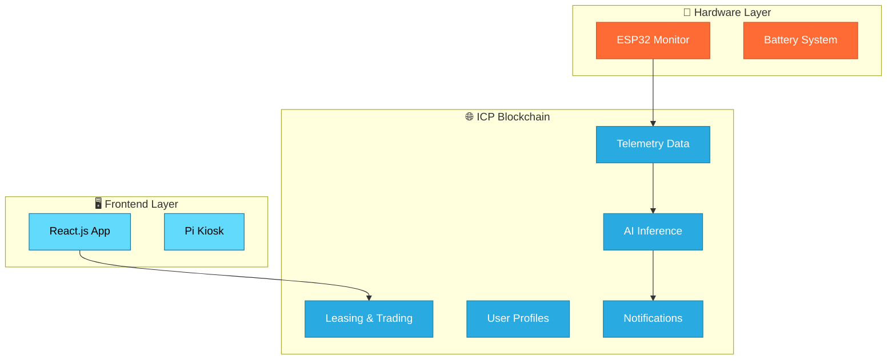

# ⚡ ChargeX: Decentralized Battery-as-a-Service Platform

<div align="center">

[](https://internetcomputer.org/)
[](https://www.rust-lang.org/)
[](https://reactjs.org/)
[](https://opensource.org/licenses/MIT)

**🏆 WCHL 2025 Hackathon Project**

*Revolutionizing Battery Ownership Through Decentralized Technology*

[🚀 Live Demo](https://chargex.ic0.app) • [📖 Documentation](docs/) • [🎯 Roadmap](#roadmap) • [💬 Community](https://discord.gg/chargex)

</div>

---

## 🌟 What is ChargeX?

Imagine never worrying about your electric scooter, e-bike, or device running out of power again. **ChargeX** is the world's first fully decentralized Battery-as-a-Service (BaaS) platform that transforms how we think about battery ownership and energy sharing.

Built entirely on the **Internet Computer Protocol (ICP)**, ChargeX combines IoT hardware, on-chain AI, and blockchain technology to create a transparent, secure, and efficient peer-to-peer battery ecosystem.

### 🎯 The Problem We Solve
- **Limited Battery Access**: No easy way to rent charged batteries when needed
- **Centralized Control**: Big tech controls your battery data and services
- **Energy Waste**: Unused battery power can't be easily shared or monetized
- **Maintenance Guesswork**: Difficult to predict battery health and lifespan

### ✨ Our Solution
- **🔋 Flexible Battery Leasing**: Rent charged batteries anywhere, anytime
- **⚡ P2P Energy Trading**: Sell your excess battery power directly to others
- **🤖 AI-Powered Insights**: Smart predictions for battery health and maintenance
- **🔐 True Decentralization**: You own your data, not big corporations

## 🏆 WCHL 2025 Track Alignment

<table>
<tr>
<td width="25%" align="center">
<h3>🌐 Fully On-Chain</h3>
<p>Complete decentralization with frontend, backend, and data storage all on ICP</p>
</td>
<td width="25%" align="center">
<h3>🤖 DeAI</h3>
<p>On-chain AI models for predictive maintenance and battery optimization</p>
</td>
<td width="25%" align="center">
<h3>₿ Bitcoin DeFi</h3>
<p>Seamless ckBTC integration for P2P energy trading and payments</p>
</td>
<td width="25%" align="center">
<h3>🏭 RWA</h3>
<p>Physical batteries tokenized as ICRC-7 NFTs with real-world utility</p>
</td>
</tr>
</table>

## 🏗️ Project Structure

```
ICP-ChargeX/
├── main-website/          # Marketing & Landing Page
├── application/           # Core BaaS Platform
├── hardware/             # IoT Hardware Components
├── shared/               # Shared Libraries & Utils
├── docs/                 # Documentation & Diagrams
├── deployment/           # Deployment Configurations
└── scripts/              # Build & Utility Scripts
```

## ⚡ Key Features

<div align="center">

| 🔋 Battery Leasing | 🔄 Energy Trading | 🤖 AI Analytics | 📍 Real-time Tracking |
|:---:|:---:|:---:|:---:|
| Tokenized rentals via ICRC-7 NFTs | P2P energy marketplace | Predictive maintenance | GPS location monitoring |
| **🔐 Identity** | **💰 Multi-token** | **📱 Mobile Ready ( PWA )** | **🌐 Fully Decentralized** |
| Internet Identity integration | ckBTC & ICRC tokens | Cross-platform support | No single point of failure |

</div>

## 🛠️ Technology Stack

### Hardware
- **ESP32**: Battery monitoring & telemetry
- **Raspberry Pi**: Kiosk interface & battery disbursement
- **BMS**: Battery Management System

### Software
- **Frontend**: React.js (served from ICP)
- **Backend**: Multiple ICP Canisters
- **Blockchain**: Internet Computer Protocol (ICP)
- **Tokens**: ICRC-7 (NFTs), ckBTC, ICRC-1/ICRC-2

## 🚀 Quick Start

### 📋 Prerequisites
```bash
# Install Node.js 18+
node --version  # Should be 18+

# Install DFX SDK
sh -ci "$(curl -fsSL https://sdk.dfinity.org/install.sh)"

# Install Rust for canister development
curl --proto '=https' --tlsv1.2 -sSf https://sh.rustup.rs | sh

# Arduino IDE for hardware (optional)
# Download from: https://www.arduino.cc/en/software
```

### ⚡ Installation
```bash
# Clone the repository
git clone https://github.com/Tomeku-Development/ICP-ChargeX.git
cd ICP-ChargeX

# Install all dependencies
npm run setup

# Start local ICP replica
dfx start --background

# Deploy all canisters
dfx deploy

# Start the frontend
npm run dev
```

### 🎮 Try the Demo
1. Open http://localhost:3000
2. Login with Internet Identity
3. Explore the battery leasing interface
4. Test P2P energy trading features

## 📊 Architecture Overview

<div align="center">



[📖 View Detailed Architecture](docs/architecture/README.md) • [🔄 User Flow Diagrams](docs/diagrams/user-flows/)

</div>

## 👥 Contributing

1. Fork the repository
2. Create a feature branch
3. Commit your changes
4. Push to the branch
5. Create a Pull Request

## 📄 License

This project is licensed under the MIT License - see the [LICENSE](LICENSE) file for details.

## 🔗 Links

- [Technical Documentation](ChargeX_Decentralized_BaaS_Platform_on_ICP_Technical_Documentation.md)
- [Easy Guide](ChargeX_Easy_Guide_to_Decentralized_BaaS_on_ICP.md)
- [Live Demo](https://chargex.ic0.app)

## 📞 Support

For support, email support@chargex.io or join our [Discord](https://discord.gg/chargex).

---

**Built with ❤️ on Internet Computer Protocol**
