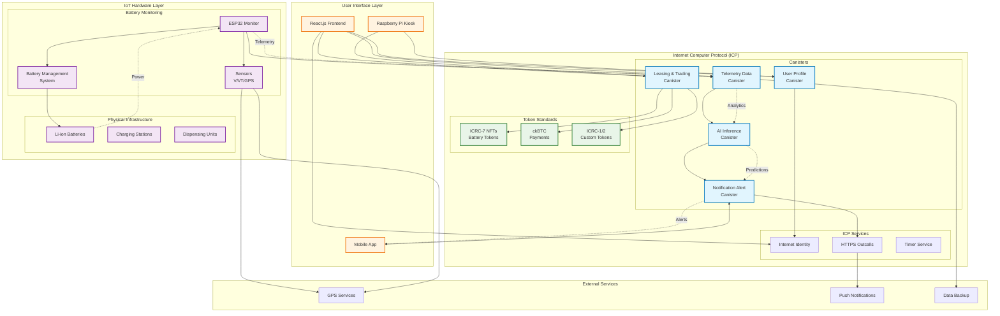
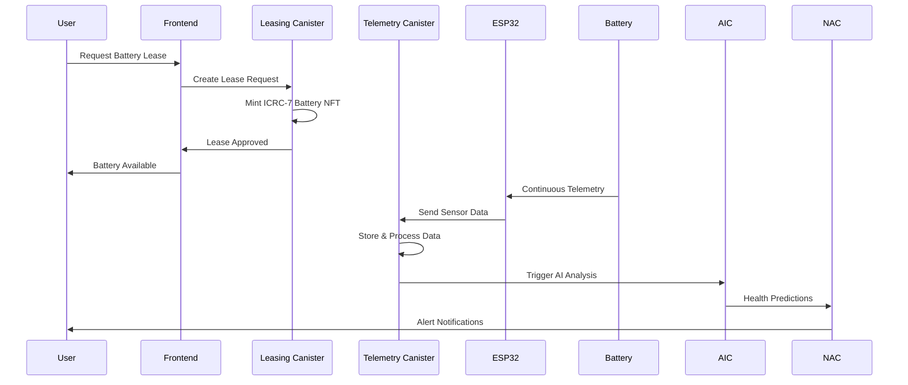
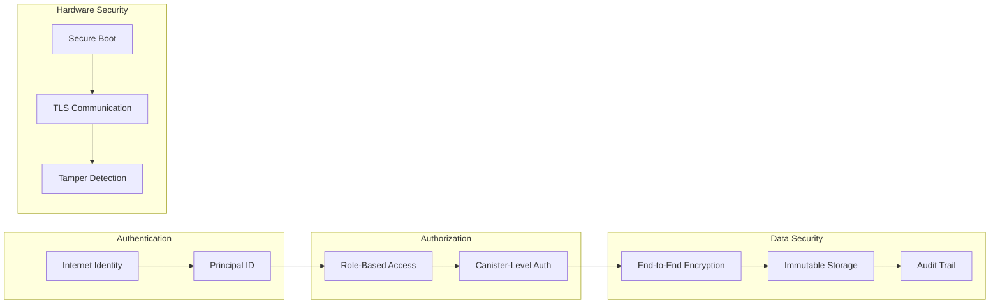

# ChargeX System Architecture

## 🏗️ High-Level Architecture Diagram

## 🔧 Component Details

### Frontend Layer
- **React.js Web App**: Main user interface served from ICP Asset Canister
- **Raspberry Pi Kiosk**: Physical battery dispensing interface
- **Mobile Integration**: Push notifications and mobile-optimized UI

### ICP Canister Layer
- **Leasing & Trading**: Battery lease management and P2P energy trading
- **Telemetry Data**: IoT data storage and real-time processing
- **AI Inference**: On-chain predictive maintenance and analytics
- **User Profile**: User management and preferences
- **Notification Alert**: Alert system and external communications

### Token Standards
- **ICRC-7 NFTs**: Unique battery representation and ownership
- **ckBTC**: Bitcoin-based payments and settlements
- **ICRC-1/2**: Custom tokens for energy trading

### Hardware Layer
- **ESP32 Monitors**: Battery telemetry collection and transmission
- **Sensor Array**: Voltage, current, temperature, and GPS sensors
- **Battery Management**: Safety and charge management systems

## 🔄 Data Flow Architecture

## 🔒 Security Architecture

