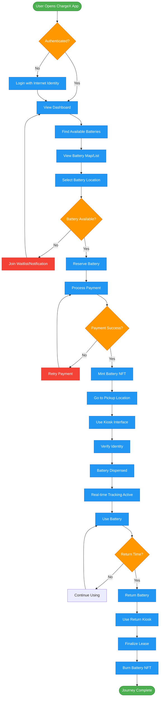
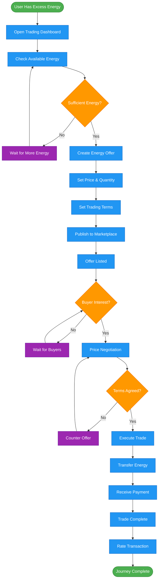
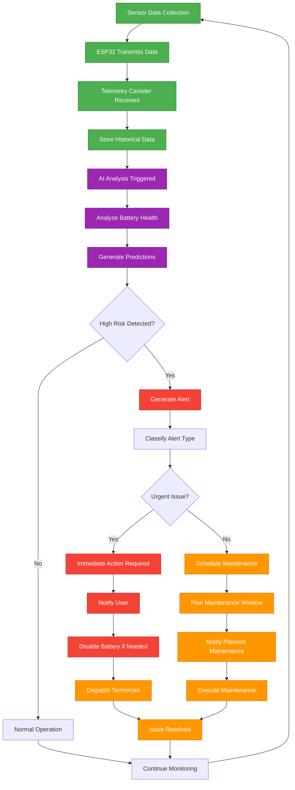
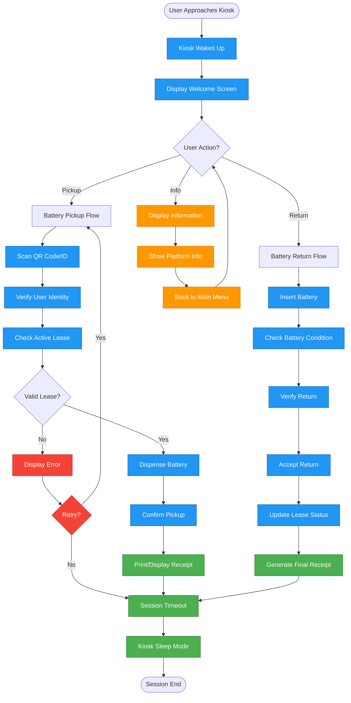
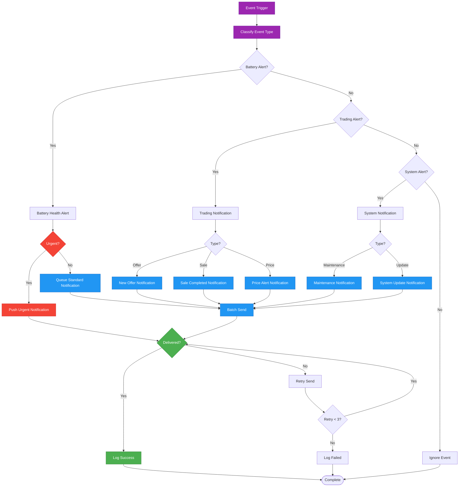

# ChargeX User Flow Diagrams

## 🔋 Battery Leasing User Journey

## ⚡ Energy Trading User Journey

## 🤖 AI Predictive Maintenance Flow

## 🏪 Kiosk Interaction Flow

## 📱 Mobile Notification Flow

