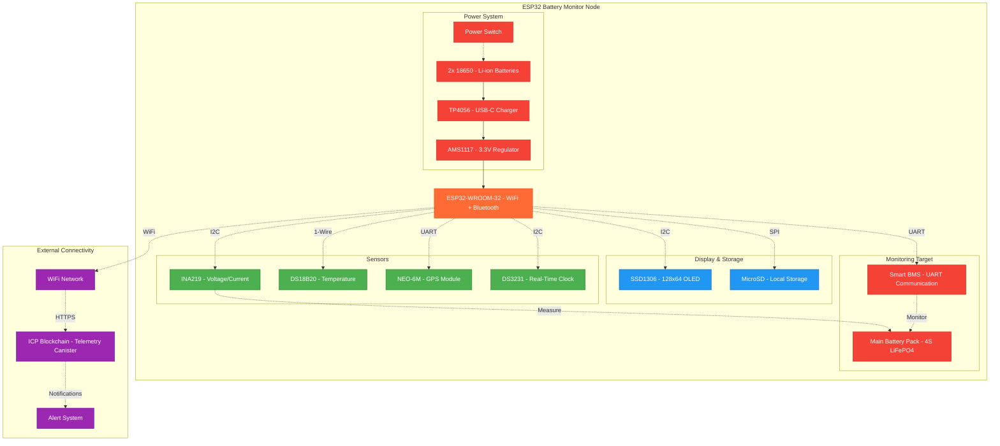
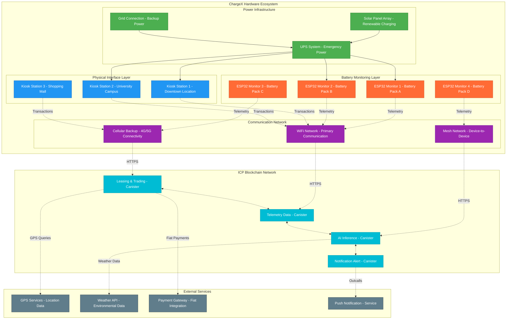

# ChargeX Hardware Bill of Materials (BOM)

## 📋 Overview

Complete hardware specifications and bill of materials for the ChargeX decentralized Battery-as-a-Service platform, including ESP32 battery monitors, Raspberry Pi kiosks, and supporting components.

---

## 🔧 **ESP32 Battery Monitoring Node**

### Core Components

| Component | Part Number | Quantity | Unit Price | Total | Supplier | Notes |
|-----------|-------------|----------|------------|-------|----------|-------|
| **ESP32 Development Board** | ESP32-WROOM-32 | 1 | $8.50 | $8.50 | Espressif | WiFi + Bluetooth |
| **Voltage/Current Sensor** | INA219 Breakout | 1 | $6.95 | $6.95 | Adafruit | High-precision I2C |
| **Temperature Sensor** | DS18B20 Waterproof | 1 | $4.50 | $4.50 | Maxim | Digital, waterproof |
| **GPS Module** | NEO-6M with Antenna | 1 | $12.00 | $12.00 | u-blox | High accuracy GPS |
| **OLED Display** | SSD1306 128x64 | 1 | $5.95 | $5.95 | Optional | Status display |
| **MicroSD Card Module** | SPI Interface | 1 | $3.50 | $3.50 | Generic | Local data storage |
| **Real-Time Clock** | DS3231 RTC Module | 1 | $4.95 | $4.95 | Maxim | Precision timekeeping |

### Power Management

| Component | Part Number | Quantity | Unit Price | Total | Supplier | Notes |
|-----------|-------------|----------|------------|-------|----------|-------|
| **Li-ion Battery** | 18650 3.7V 3000mAh | 2 | $8.00 | $16.00 | Samsung/LG | High capacity |
| **Battery Holder** | 2x18650 with leads | 1 | $3.50 | $3.50 | Generic | Secure mounting |
| **Charging Module** | TP4056 with protection | 1 | $2.95 | $2.95 | Generic | USB-C charging |
| **Power Regulator** | AMS1117-3.3V | 1 | $1.50 | $1.50 | Generic | Stable 3.3V supply |
| **Power Switch** | SPDT Slide Switch | 1 | $1.25 | $1.25 | Generic | Manual power control |

### Connectivity & Protection

| Component | Part Number | Quantity | Unit Price | Total | Supplier | Notes |
|-----------|-------------|----------|------------|-------|----------|-------|
| **WiFi Antenna** | 2.4GHz PCB Antenna | 1 | $2.50 | $2.50 | Generic | External antenna |
| **Enclosure** | IP65 Waterproof Box | 1 | $12.95 | $12.95 | Generic | Weather protection |
| **Cable Glands** | PG7 Waterproof | 3 | $1.50 | $4.50 | Generic | Cable entry points |
| **Mounting Hardware** | Stainless Steel Bolts | 1 set | $5.00 | $5.00 | Generic | Secure mounting |

### **ESP32 Node Total: $101.05**

---

## 🖥️ **Raspberry Pi Kiosk System**

### Core Computing

| Component | Part Number | Quantity | Unit Price | Total | Supplier | Notes |
|-----------|-------------|----------|------------|-------|----------|-------|
| **Raspberry Pi** | Pi 4 Model B 4GB | 1 | $75.00 | $75.00 | Raspberry Pi | Main computing unit |
| **MicroSD Card** | 64GB Class 10 | 1 | $15.00 | $15.00 | SanDisk | OS and storage |
| **Power Supply** | USB-C 15W Official | 1 | $12.00 | $12.00 | Raspberry Pi | Stable power |
| **Heatsink Case** | Aluminum with Fan | 1 | $18.95 | $18.95 | Generic | Thermal management |

### Display & Input

| Component | Part Number | Quantity | Unit Price | Total | Supplier | Notes |
|-----------|-------------|----------|------------|-------|----------|-------|
| **Touchscreen** | 7" DSI Capacitive | 1 | $65.00 | $65.00 | Raspberry Pi | Official display |
| **Display Cable** | DSI Ribbon Cable | 1 | $5.95 | $5.95 | Generic | Connection cable |
| **USB Camera** | 1080p with Mic | 1 | $25.00 | $25.00 | Logitech | QR code scanning |
| **Speaker** | 5W Mono Amplifier | 1 | $8.95 | $8.95 | Adafruit | Audio feedback |

### Mechanical Components

| Component | Part Number | Quantity | Unit Price | Total | Supplier | Notes |
|-----------|-------------|----------|------------|-------|----------|-------|
| **Servo Motor** | MG996R High Torque | 2 | $12.50 | $25.00 | TowerPro | Battery dispensing |
| **Linear Actuator** | 12V 100mm stroke | 1 | $35.00 | $35.00 | Generic | Vertical movement |
| **Limit Switches** | Micro Switch SPDT | 4 | $2.50 | $10.00 | Generic | Position sensing |
| **Relay Module** | 4-Channel 5V | 1 | $8.95 | $8.95 | Generic | Motor control |

### Kiosk Enclosure

| Component | Part Number | Quantity | Unit Price | Total | Supplier | Notes |
|-----------|-------------|----------|------------|-------|----------|-------|
| **Metal Enclosure** | NEMA 4X Stainless | 1 | $185.00 | $185.00 | Hoffman | Weather resistant |
| **Viewing Window** | Polycarbonate 8"x10" | 1 | $25.00 | $25.00 | Generic | Display protection |
| **Locks** | Cam Lock Set | 2 | $15.00 | $30.00 | Generic | Security |
| **LED Strip** | RGB Addressable | 1 | $12.95 | $12.95 | Generic | Status indication |

### **Raspberry Pi Kiosk Total: $562.75**

---

## 🔋 **Battery Management System (BMS)**

### Smart BMS Components

| Component | Part Number | Quantity | Unit Price | Total | Supplier | Notes |
|-----------|-------------|----------|------------|-------|----------|-------|
| **Smart BMS** | 4S 12V 100A with UART | 1 | $45.00 | $45.00 | Generic | Communication capable |
| **Current Shunt** | 100A/75mV | 1 | $8.95 | $8.95 | Generic | Precision measurement |
| **Temperature Probes** | NTC 10K Thermistor | 4 | $2.50 | $10.00 | Generic | Cell monitoring |
| **Balancing Resistors** | 10W 10Ω | 4 | $3.50 | $14.00 | Generic | Cell balancing |

### Safety Components

| Component | Part Number | Quantity | Unit Price | Total | Supplier | Notes |
|-----------|-------------|----------|------------|-------|----------|-------|
| **Fuses** | 125A ANL Fuse | 2 | $8.95 | $17.90 | Generic | Overcurrent protection |
| **Fuse Holders** | ANL Fuse Block | 2 | $12.50 | $25.00 | Generic | Secure fuse mounting |
| **Contactors** | 12V 100A DC | 2 | $25.00 | $50.00 | Generic | Emergency disconnect |
| **Emergency Stop** | Mushroom Button | 1 | $15.95 | $15.95 | Generic | Manual shutdown |

### **BMS Total: $186.80**

---

## 🔌 **Power & Charging Infrastructure**

### Main Battery Pack

| Component | Part Number | Quantity | Unit Price | Total | Supplier | Notes |
|-----------|-------------|----------|------------|-------|----------|-------|
| **LiFePO4 Cells** | 32700 3.2V 6000mAh | 4 | $15.00 | $60.00 | EVE Energy | Long cycle life |
| **Cell Holders** | 32700 Battery Holder | 4 | $3.50 | $14.00 | Generic | Secure mounting |
| **Nickel Strips** | 8mm x 0.15mm | 2m | $8.95 | $8.95 | Generic | Cell connections |
| **Insulation** | Kapton Tape 25mm | 1 roll | $12.95 | $12.95 | Generic | Electrical isolation |

### Charging System

| Component | Part Number | Quantity | Unit Price | Total | Supplier | Notes |
|-----------|-------------|----------|------------|-------|----------|-------|
| **DC-DC Charger** | 12V 20A MPPT | 1 | $45.00 | $45.00 | Generic | Efficient charging |
| **AC Adapter** | 24V 10A Desktop | 1 | $35.00 | $35.00 | Generic | Mains charging |
| **Charging Port** | Anderson SB50 | 2 | $8.95 | $17.90 | Anderson | Standard connector |
| **LED Indicators** | 12V Status LEDs | 3 | $2.50 | $7.50 | Generic | Charge status |

### **Power Infrastructure Total: $201.30**

---

## 🛠️ **Hardware Architecture Diagrams**

### ESP32 Battery Monitor Architecture

### Raspberry Pi Kiosk Architecture

```mermaid
graph TB
    subgraph "Raspberry Pi Kiosk System"
        PI[Raspberry Pi 4B - 4GB RAM + 64GB SD]
        
        subgraph "User Interface"
            TOUCH[7 inch DSI Touchscreen - 1024x600]
            CAM[USB Camera - 1080p + Mic]
            SPEAKER[5W Speaker - Audio Feedback]
            LED[RGB LED Strip - Status Indication]
        end
        
        subgraph "Mechanical System"
            SERVO1[Servo Motor 1 - Horizontal Movement]
            SERVO2[Servo Motor 2 - Dispensing Gate]
            LINEAR[Linear Actuator - Vertical Movement]
            LIMIT[4x Limit Switches - Position Sensing]
            RELAY[4-Ch Relay Module - Motor Control]
        end
        
        subgraph "Battery Storage"
            SLOT1[Battery Slot 1]
            SLOT2[Battery Slot 2]
            SLOT3[Battery Slot 3]
            SLOT4[Battery Slot 4]
            SENSOR[Presence Sensors<br/>IR/Magnetic]
        end
        
        subgraph "Security & Enclosure"
            LOCK1[Cam Lock 1 - Main Access]
            LOCK2[Cam Lock 2 - Battery Chamber]
            ENCLOSURE[NEMA 4X Enclosure - Stainless Steel]
            WINDOW[Polycarbonate Window - Display Protection]
        end
    end
    
    subgraph "External Connections"
        POWER[24V DC Power Supply - 10A Capacity]
        ETH[Ethernet Connection - Primary Network]
        WIFI_K[WiFi Backup - Secondary Network]
        ICP_K[ICP Network - Canister Communication]
    end
    
    %% Internal Connections
    PI -.->|DSI| TOUCH
    PI -.->|USB| CAM
    PI -.->|3.5mm| SPEAKER
    PI -.->|GPIO| LED
    PI -.->|GPIO| RELAY
    PI -.->|GPIO| LIMIT
    PI -.->|GPIO| SENSOR
    
    RELAY -.->|12V| SERVO1
    RELAY -.->|12V| SERVO2
    RELAY -.->|12V| LINEAR
    
    SERVO1 -.->|Mechanical| SLOT1
    SERVO1 -.->|Mechanical| SLOT2
    SERVO2 -.->|Mechanical| SLOT3
    SERVO2 -.->|Mechanical| SLOT4
    LINEAR -.->|Mechanical| SLOT1
    LINEAR -.->|Mechanical| SLOT2
    
    LOCK1 -.->|Secure| ENCLOSURE
    LOCK2 -.->|Secure| SLOT1
    LOCK2 -.->|Secure| SLOT2
    WINDOW -.->|Protect| TOUCH
    
    %% External Connections
    POWER --> PI
    POWER --> RELAY
    ETH -.-> PI
    WIFI_K -.-> PI
    PI -.->|Network| ICP_K
    
    classDef pi fill:#c62828,stroke:#8d1e1e,color:#fff
    classDef ui fill:#2196f3,stroke:#1565c0,color:#fff
    classDef mechanical fill:#ff9800,stroke:#ef6c00,color:#fff
    classDef storage fill:#4caf50,stroke:#2e7d32,color:#fff
    classDef security fill:#9c27b0,stroke:#6a1b9a,color:#fff
    classDef external fill:#607d8b,stroke:#37474f,color:#fff
    
    class PI pi
    class TOUCH,CAM,SPEAKER,LED ui
    class SERVO1,SERVO2,LINEAR,LIMIT,RELAY mechanical
    class SLOT1,SLOT2,SLOT3,SLOT4,SENSOR storage
    class LOCK1,LOCK2,ENCLOSURE,WINDOW security
    class POWER,ETH,WIFI_K,ICP_K external
```

### Complete System Integration

---

## 💰 **Cost Summary**

| System Component | Estimated Cost | Quantity | Total Cost |
|------------------|----------------|----------|------------|
| **ESP32 Monitor Node** | $101.05 | 4 units | $404.20 |
| **Raspberry Pi Kiosk** | $562.75 | 3 units | $1,688.25 |
| **Battery Management System** | $186.80 | 4 units | $747.20 |
| **Power Infrastructure** | $201.30 | 1 system | $201.30 |
| **Installation & Misc** | - | - | $300.00 |

### **Total Hardware Investment: $3,340.95**

---

## 📦 **Procurement Strategy**

### Phase 1: Prototype (Single Unit Each)
- **Budget**: $1,050
- **Timeline**: 2-3 weeks
- **Focus**: Proof of concept and testing

### Phase 2: Pilot Deployment (3 Complete Systems)
- **Budget**: $3,341
- **Timeline**: 4-6 weeks
- **Focus**: Real-world testing and validation

### Phase 3: Production Scale
- **Volume Discounts**: 15-25% reduction
- **Optimized Design**: Cost reduction through simplification
- **Local Manufacturing**: Reduced shipping and lead times

---

## 🔧 **Assembly & Testing Requirements**

### Tools Needed
- Soldering station and supplies
- Multimeter and oscilloscope
- 3D printer for custom enclosures
- Basic hand tools and drill
- Programming cables and adapters

### Testing Protocol
1. **Component Testing**: Individual component validation
2. **Integration Testing**: System-level functionality
3. **Environmental Testing**: Weather resistance validation
4. **Stress Testing**: Long-term reliability assessment
5. **Field Testing**: Real-world deployment validation

---

## 📋 **Maintenance & Support**

### Preventive Maintenance
- **Monthly**: Visual inspection and cleaning
- **Quarterly**: Calibration and software updates
- **Annually**: Component replacement and upgrades

### Remote Monitoring
- **24/7 Monitoring**: Real-time health status
- **Predictive Maintenance**: AI-driven failure prediction
- **Remote Updates**: OTA firmware and software updates

This comprehensive BOM provides everything needed to build a production-ready ChargeX hardware infrastructure, with detailed cost analysis and architectural diagrams for clear understanding and implementation.
